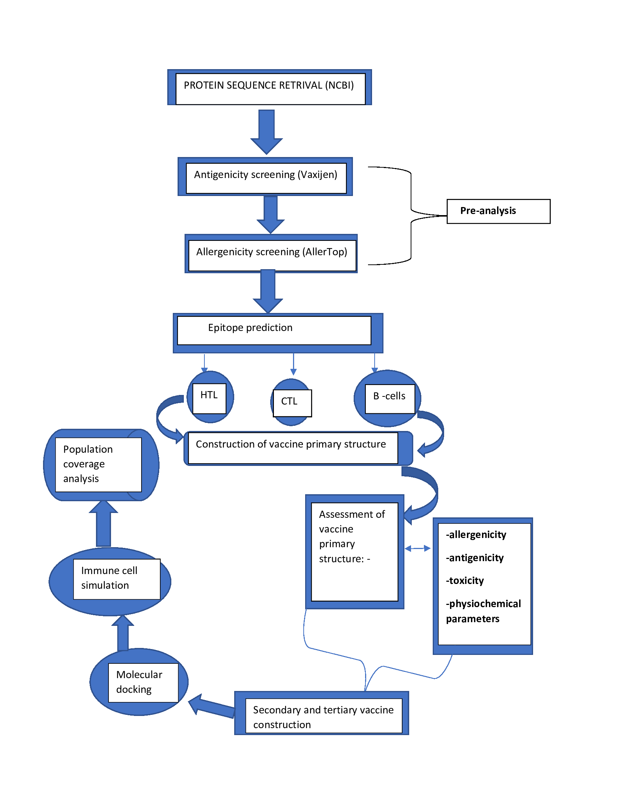

# staphyprot
## Designing a Novel Multi-epitope Vaccine Targeting  Enterotoxin B in Staphylococcus aureus (S.aureus)

The emergence of antimicrobial resistance (AMR) among Staphylococcus aureus (S.aureus) strains has exacerbated the infection by these pathogens. Despite various research efforts, still there is no effective vaccine against S. aureus infections. In this study, a multi-epitope vaccine was constructed as a potential vaccine candidate for S. aureus. The protein of choice was Staphylococcal Enterotoxin B (SEB) a surface toxoid associated with food poisoning. The vaccine construct created in this study was observed to be a non-allergenic, non-toxic antigen with a higher antigenicity than the native SEB protein. A variety of computational methods were utilized to locate epitopes that may be exploited in vaccine construction. The final vaccine construct had four hundred and one amino acids, a half-life of >10 hours in E.coli (in vivo), and a stability index of 31.45 which classifies it as a stable construct.

## Workflow

## Team
1. Vanessa Natasha Onyonyi (VNO)- International Centre for Insect Physiology and Ecology (ICIPE), Nairobi, ‎Kenya
2. Jimmy Kipetuan Nkaiwuatei (JKN)- Department of Biochemistry, College of Health sciences, Jomo Kenyatta University of Agriculture and Technology (JKUAT), Nairobi, Kenya.
3. Sisay Teka Degechisa (STD)- Department of Medical Biochemistry, College of Health sciences, Addis Ababa University, Addis Ababa,  Ethiopia
4. Olaitan I. Awe (OIA) - African Society for Bioinformatics and Computational Biology (ASBCB), Cape Town, South Africa
